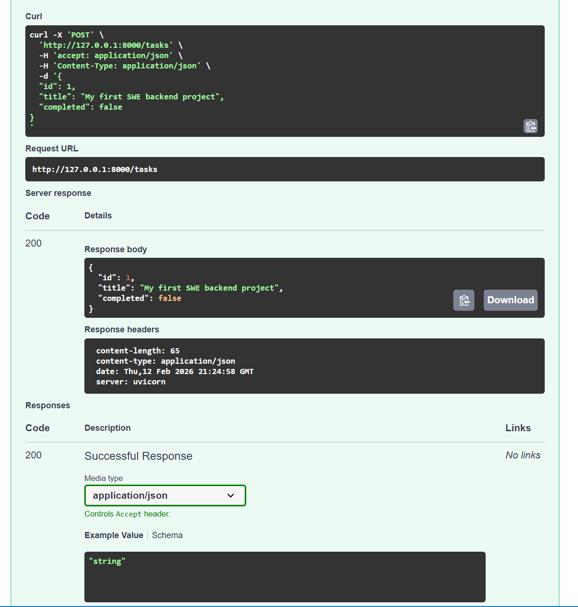
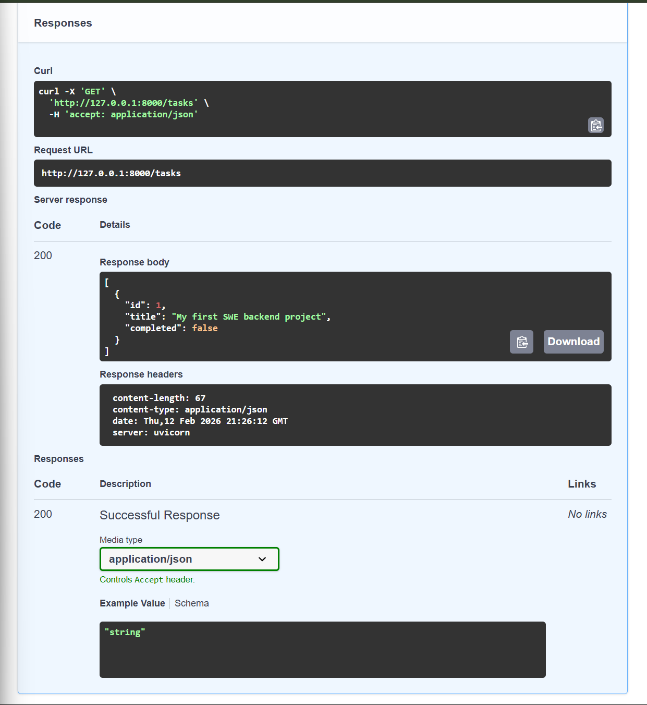

# Task Manager REST API (FastAPI)

A lightweight REST API for managing tasks (create, list, update, delete) built with **FastAPI** and backed by **SQLite** via **SQLAlchemy**. It’s designed as a simple, clean starter project for learning or prototyping.

> Data is stored in a local SQLite file (`tasks.db`) created automatically on first run.

## Features

- FastAPI-powered REST endpoints
- Request validation via Pydantic models
- Interactive API docs (Swagger UI) out of the box
- Simple CRUD-style flow (List / Create / Update / Delete)
- Persistent storage with SQLite + SQLAlchemy

## Tech Stack

- Python 3.9+
- FastAPI
- Pydantic
- SQLAlchemy
- SQLite
- Uvicorn (development server)

## Project Structure

- `main.py` — FastAPI application and routes
- `images/` — screenshots used in this README

## Getting Started

### 1) Create and activate a virtual environment (recommended)

**Windows (PowerShell)**

```powershell
python -m venv .venv
.\.venv\Scripts\Activate.ps1
```

### 2) Install dependencies

```powershell
pip install -r requirements.txt
```

### 3) Run the API

```powershell
uvicorn main:app --reload
```

FastAPI will expose interactive documentation (Swagger UI / ReDoc) automatically when the server is running.

## API Reference

### `GET /`

Health-check style endpoint.

**Response**

```json
{ "message": "Task Manager API running with SQLite" }
```

### `GET /tasks`

Returns all tasks currently stored in the SQLite database.

**Response**

```json
[
  { "id": 1, "title": "Buy milk", "completed": false }
]
```

### `POST /tasks`

Creates a new task.

**Request body**

```json
{ "title": "Buy milk", "completed": false }
```

**Response**

Returns the created task (including its server-generated `id`).

### `PUT /tasks/{task_id}`

Updates an existing task by `id`.

**Request body**

```json
{ "title": "Buy milk (updated)", "completed": true }
```

**Response**

Returns the updated task.

### `DELETE /tasks/{task_id}`

Deletes a task by its `id`.

**Response**

```json
{ "status": "deleted" }
```

## Screenshots

### Swagger UI


### POST /tasks example



### Quick test run



## Notes / Limitations

- Creates/uses a local SQLite file named `tasks.db`.
- Minimal error handling (missing IDs return a simple JSON error response).
- No authentication/authorization.

## Next Improvements (Optional)

- Return proper HTTP status codes using `HTTPException` (e.g., 404 on missing task)
- Add filtering/pagination for `GET /tasks`
- Add database migrations (Alembic)
- Add tests with `pytest`
